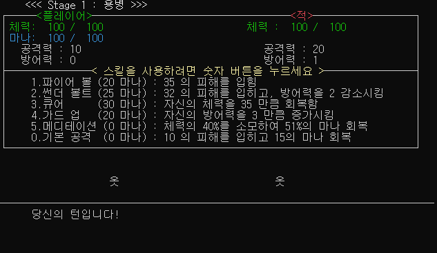
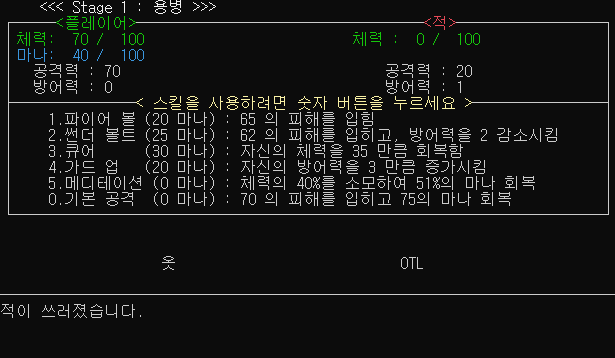
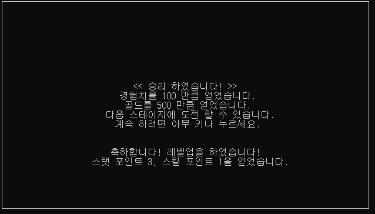

### - 프로젝트명
- 턴제 전투방식 RPG 게임 - 마법사의 모험

### - 개발 환경
- C, Visual Studio

### - 주요 기능
- 랜덤으로 4가지 스킬을 사용하는 컴퓨터와 번갈아 싸우는 턴제 전투 방식 기능
- 총 10가지 스테이지의 단계별 구성과 각기 다른 스킬
- 특수문자를 활용한 스킬 이펙트 애니메이션 구현
- 체력, 마나, 공격력 등 다양한 능력치와 각종 스킬이 존재하며, 플레이어 레벨업시 획득 포인트로 원하는 능력치, 스킬 강화 가능
- 기절, 지속피해, 공격력 증가, 방어력 감소, 체력 흡수 등의 상태이상, 버프, 특수효과 구현
- 전투 승리시 획득하는 골드로 무기 구입 및 장착 가능
- 승패 점수에 따른 랭크 시스템 (브론즈~마스터)
- 치트키 기능


- 코딩에 대한 지식이 없는 21살 그 당시, 약 4주간 책으로 함수 파트까지만 독학하고 바로 무작정 제작하여 코드가 엉망인점 양해 부탁드립니다.

### - 구동 과정
#### 1. 프로그램 시작


- 프로그램을 시작하면 인트로 화면이 실행됩니다.
- 아무 키를 누르면 메인 메뉴로 진입됩니다.

```c
void window() // 테두리 생성
{
    int x, y;
    gotoxy(0, 0);
    puts("┌");
    gotoxy(78, 0);
    puts("┐");
    gotoxy(0, 22);
    puts("└");
    gotoxy(78, 22);
    puts("┘");
    for (x = 2; x < 78; x = x + 2)
    {
        gotoxy(x, 0);
        puts("──");
        gotoxy(x, 22);
        puts("──");
    }
    for (y = 1; y < 22; y++)
    {
        gotoxy(0, y);
        puts("│");
        gotoxy(78, y);
        puts("│");
    }
}
void intro_screen()
{
    window();       // 테두리
    gotoxy(24, 2);
    printf("         마법사의 모험\n");
    gotoxy(24, 3);
    printf("           Ver 1.0\n");
    gotoxy(50, 20);
    printf("Made by cd991478 / 백성진\n");
    gotoxy(22, 14);
    printf("   시작하려면 아무 키나 누르세요.\n");
    gotoxy(50, 18);
    printf("  cd991478@naver.com\n");
}

void main(void) 
{
    setcursortype(NOCURSOR);
    
    intro_screen();

    _getch();

    // ... //
}
```

---

#### 2. 메인 메뉴


- 메인 메뉴에서 해당하는 숫자 키를 눌러 여러가지 기능들을 이용할 수 있습니다.
- 1번 키를 누르면 전투 메뉴로 진입합니다.

```c
void main(void) 
{
  for (;;) // 반복
  {
    menu_choose(); // 메인 메뉴 화면 출력
    choose = _getch(); // 메뉴 선택

    if (choose == 0x31) // 1. 전투 선택
    { ... }
    if (choose == 0x32 && player_statpoint > 0)  // 2. 스탯 선택 (스탯 포인트를 보유한 경우)
    { ... }
    if (choose == 0x32 && player_statpoint == 0) // 2. 스탯 선택 (스탯 포인트가 없는 경우)
    { ... }
    if (choose == 0x33 && player_skillpoint > 0) // 3. 스킬 선택 (스킬 포인트가 있는 경우)
    { ... }
    if (choose == 0x33 && player_skillpoint == 0)// 3. 스킬 선택 (스킬 포인트가 없는 경우)
    { ... }
    if (choose == 0x34) // 4. 무기 선택
    { ... }
    if (choose == 0x35) // 5. 치트 선택
    { ... }
    if (choose == 0x36) // 6. 설정 선택
    { ... }
    if (choose == 0x37) // 7. 도움말 선택
    { ... }
    if (choose == 0x38) // 8. 정보 선택
    { ... }
    if (choose == 0x30 && stage_level >= 11)      // 0. 클리어 코드 확인 선택 (스테이지 모두 클리어시)
    { ... }
  }  
}
```

---

#### 3. 전투 스테이지 선택


- 전투 메뉴 진입시 먼저 스테이지를 선택할 수 있습니다.
- 스테이지 번호를 입력하면 컴퓨터와 전투가 시작됩니다.
- 1스테이지부터 진행 가능하며, 최대 10스테이지까지 존재합니다.
- 만약 1스테이지 클리어에 성공 한다면, 그 다음 단계인 2스테이지 도전이 가능하며, 그 아래 단계도 다시 플레이 가능합니다.

```c
// 1. 전투 선택
if (choose == 0x31) {   

    total = win + lose; // 총 전투 횟수 설정
    menu_fight = 1;     // 전투 메뉴 진입 플래그 변수 설정

    stat_restore();     // 스탯 설정
    stat_over();        // 스탯 정리
    system("cls");
    printf("┌────────────────────────────────────────────────────┐      \n");
    printf("│   <<<스테이지 번호를 입력하고 엔터를 누르세요>>>   │   \n");
    printf("│            1-10 스테이지 까지 있으며,              │    \n");
    printf("│ %d 스테이지 클리어시 그 다음 스테이지 플레이 가능.      \n", stage_level);
    printf("│      (메인 메뉴로 돌아가려면 숫자 0을 입력)        │      \n");
    printf("└────────────────────────────────────────────────────┘   \n");

    if (win >= 1 || lose >= 1) // 한번이라도 전투를 치룬 경우 승률 및 점수 표시
    {
        printf("      %d승 %d패   승률 : %.2f %%  점수 : %d\n", win, lose, (float)win * 100 / (float)total, rating);
    }

    // ... 랭크 시스템 코드 부분 생략 ... // 

    gotoxy(53, 3);
    puts("│");
    gotoxy(0, 10);

    scanf_s("%d", &goto_stage);     // 스테이지 입력 받기

    if (stage_level < goto_stage)   // 플레이 가능한 스테이지 이상으로 시도 하는 경우
    {
        printf("해당 스테이지는 아직 플레이 할 수 없습니다.\n");
        printf("     계속 하려면 아무 키나 누르세요.\n");
        _getch();
        continue;
    }

    if (goto_stage == 1) {      // 입력 받은 스테이지별 컴퓨터 능력치 설정
        com_maxhp = 100;
        com_att = 20;
        com_def = 1;
    }
    else if (goto_stage == 2) {
        com_maxhp = 200;
        com_att = 30;
        com_def = 3;
    }
    else if (goto_stage == 3) {
        com_maxhp = 300;
        com_att = 40;
        com_def = 6;
    }
    else if (goto_stage == 4) {
        com_maxhp = 500;
        com_att = 50;
        com_def = 10;
    }
    else if (goto_stage == 5) {
        com_maxhp = 700;
        com_att = 60;
        com_def = 15;
    }
    else if (goto_stage == 6) {
        com_maxhp = 1000;
        com_att = 70;
        com_def = 20;
    }
    else if (goto_stage == 7) {
        com_maxhp = 1500;
        com_att = 80;
        com_def = 25;
    }
    else if (goto_stage == 8) {
        com_maxhp = 2000;
        com_att = 90;
        com_def = 30;
    }
    else if (goto_stage == 9) {
        com_maxhp = 3000;
        com_att = 100;
        com_def = 35;
    }
    else if (goto_stage == 10) {
        com_maxhp = 5000;
        com_att = 100;
        com_def = 40;
    }
    else if (goto_stage == 0) {
        continue;
    }
    else {
        system("cls");
        printf("    잘못 입력 하였습니다\n");
        d1s();
        printf("계속 하려면 아무 키나 누르세요.\n");
        _getch();
        continue;
    }

    // 전투 개시
    for (;;){
        ...
    }
}
```


---

#### 4. 전투 진입



- 컴퓨터와 번갈아 전투를 진행하는 화면입니다. 화면 최상단에 플레이어와 컴퓨터의 현재 체력, 공격력 등 능력치 정보가 표시되며 갱신됩니다.
- 그 바로 아래에는 플레이어가 사용가능한 6가지의 스킬과 상세 정보가 표시됩니다.
- 캐릭터를 텍스트 '옷' 으로 표현하였으며, 각종 스킬을 사용할경우 이곳에서 이펙트 애니메이션이 나타납니다.
- 캐릭터 아래의 최하단 부분에는 진행 상황을 설명하는 문구가 표시됩니다.
- 자신의 차례일때, 각 스킬 번호에 대응되는 숫자키인 1, 2, 3, 4, 5, 0 을 누르면 해당 스킬을 사용합니다.

```c
void all_set()      // 전체 화면 리셋 + 스탯 변동 적용
{
    stat_over();    // 스탯 초과, 음수 처리
    system("cls");  // 화면 모두 지움
    stage_name(goto_stage); // 스테이지 이름, 현재 스테이지로 설정 
    fight_stat();   // 전투 스탯 정보 창 출력
    fight_skill();  // 전투 스킬 정보 창 출력
    char_eft();     // 두 캐릭터 정위치 출력
    txt_pos();      // 상황 설명 메세지 좌표로 이동
}
```
```c
void stat_over() // 스탯 오버시 재설정
{
    if (player_hp < 0) { // 체력 음수 처리
        player_hp = 0;
    }
    if (player_hp > player_maxhp) { // 체력 최대치 초과 처리
        player_hp = player_maxhp;
    }
    if (player_mp < 0) { // 마나 음수 처리
        player_mp = 0;
    }
    if (player_mp > player_maxmp) { // 마나 최대치 초과 처리
        player_mp = player_maxmp;
    }
    if (player_def < 0) { // 전투 방어력 음수 처리
        player_def = 0;
    }
    if (player_defup < 0) { // 방어력 상승폭 음수 처리
        player_defup = 0;
    }
    if (player_defmain < 0) { // 메인 방어력 음수 처리
        player_defmain = 0;
    }
    if (com_hp < 0) { // 컴퓨터 체력 음수 처리
        com_hp = 0;
    }
    if (com_hp > com_maxhp) { // 컴퓨터 체력 최대치 초과 처리
        com_hp = com_maxhp;
    }
    if (com_def < 0) { // 컴퓨터 방어력 음수 처리
        com_def = 0;
    }
    if (player_def + player_defup > 100)    // 플레이어 방어력이 한도치를 초과한경우 처리
    {
        for (; player_def + player_defup > 100;) // 100을 초과하면 100이 되도록 설정
        {
            player_defup--;
        }
    }
    if (player_defmain > 100)   // 플레이어 메인 방어력 한도치 초과 처리
    {
        for (; player_defmain > 100;)
        {
            player_defmain--;
        }
    }
    if (com_def > 100) // 컴퓨터 방어력 한도치 초과 처리
    {
        for (; com_def > 100;)
        {
            com_def--;
        }
    }
}
void stage_name(int a) // 전투 화면 최상단 스테이지 이름 출력
{
    textcolor(LIGHTWHITE);
    if (a == 1) {
        printf("     <<< Stage %d : %s >>>\n", a, stage01);
    }
    if (a == 2) {
        printf("     <<< Stage %d : %s >>>\n", a, stage02);
    }
    if (a == 3) {
        printf("     <<< Stage %d : %s >>>\n", a, stage03);
    }
    if (a == 4) {
        printf("     <<< Stage %d : %s >>>\n", a, stage04);
    }
    if (a == 5) {
        printf("     <<< Stage %d : %s >>>\n", a, stage05);
    }
    if (a == 6) {
        printf("     <<< Stage %d : %s >>>\n", a, stage06);
    }
    if (a == 7) {
        printf("     <<< Stage %d : %s >>>\n", a, stage07);
    }
    if (a == 8) {
        printf("       <<< Stage %d : %s >>>\n", a, stage08);
    }
    if (a == 9) {
        printf("       <<< Stage %d : %s >>>\n", a, stage09);
    }
    if (a == 10) {
        printf("       <<< Stage %d : %s >>>\n", a, stage10);
    }
    textcolor(WHITE);
}
```

---

#### 5. 플레이어 턴


- 1번 키를 눌러 '파이어볼' 스킬을 사용하면, 최하단에 해당 스킬을 사용 하였다는 설명 문구가 뜨며, 스킬의 이펙트가 재생됩니다.
- 플레이어 캐릭터는 왼쪽, 적은 오른쪽에 위치하기 때문에 플레이어가 사용한 '파이어볼' 스킬의 투사체 이펙트는 왼쪽에서 오른쪽으로 빠르게 점멸하며 이동합니다.
- '파이어볼' 스킬 투사체가 적에게 도달하면, 피격 당하는 이펙트가 나타납니다.
- 플레이어의 스킬 이펙트 재생이 모두 끝나면, 최하단의 설명 문구에 얼마만큼의 타격을 적에게 주었는지 표시됩니다.
- 타격을 준 피해량 만큼 적의 체력이 감소하며, 상단의 현재 컴퓨터 체력, 플레이어의 마나 등 변동된 수치가 갱신됩니다.
- 이렇게 플레이어 차례가 끝났으며, 이제 컴퓨터의 차례로 넘어갑니다.

```c
// void main(void)

if(choose == 0x31){

  // ... 상단에 기재된 부분 ... //

  turn = 0;       // 턴 초기화
  stat_restore(); // 스탯 복구

  for (;;)   // 전투 개시 및 반복
  {
    all_set();  // 전투 화면 갱신 및 스탯 정리

    if (player_dotecount > 0) // 지속 피해 상태 횟수가 남아있는 경우
    {
      player_doteon(com_att); // 지속 피해 적용 (all_set포함)
    }

    if (turn % 2 == 0 && player_hp > 0 && player_stun == 0) { // 플레이어 턴이면서, 플레이어 체력이 남아 있고, 기절 상태가아닌 경우

        for (;;) {  // 즉, 전투가 가능한 상태인경우, 플레이어 턴 실행

            printf("      당신의 턴입니다!\n");
            order = _getch();
            player_skill(order);    // 입력 받은 스킬 사용 및 turn++

            if (turn % 2 == 1) {    // turn이 변동 되면 탈출
                break;
            }
        }
    }
      // ... 컴퓨터 턴 부분 ... //
  }
}
```

```c
void player_skill(char a) // 전투중 입력받은 스킬 번호에 따라 스킬 사용
{
    // 1. 파이어볼 사용 했는데 마나가 불충분한 경우
    if (a == 0x31 && player_mp < 20) { 
        nomp();     // 마나 부족 문구 출력
        d1s();      // speed초 대기 (기본값 800sec)
    }

    // 1. 파이어볼 사용 했는데 마나가 충분한경우
    if (a == 0x31 && player_mp >= 20) { 
        printf("<1. 파이어 볼>을 사용 했습니다.\n"); // 문구 출력
        d1s();        // 딜레이
        skill1_eft(); // 파이어볼 이펙트 재생
        d1s();

        if (goto_stage == 6) // 현재 스테이지가 6인경우 (화염 마법사)
        {
            printf("적은 화염 속성에 면역입니다.\n");
            d1s();
            printf("피해를 받지 않습니다.\n");
        }
        if (goto_stage != 6) // 스테이지가 6이 아닌경우
        {
            com_demage(skill_1()); // 컴퓨터에게 파이어볼 데미지 적용 및 설명 문구 출력
        }

        d1s();
        player_mpdown(20); // 플레이어 마나 소모
        turn++;            // 턴 넘김
    }

    // 숫자 2 썬더볼트 사용 했는데 마나가 불충분한 경우
    if (a == 0x32 && player_mp < 25) { ... }
    // 숫자 2 썬더볼트 사용 했는데 마나가 충분한 경우
    if (a == 0x32 && player_mp >= 25) { ... }

    // ... 생략 ... //

}

void com_demage(int a) // 플레이어가 컴퓨터에게 공격한 데미지 적용 및 메세지 출력
{
    // 가한 피해량이 적의 방어력보다 높은경우
    if (a > com_def) { 
        printf("적이 %d 만큼의 피해를 받았습니다. \n", a - com_def);
        com_hp = com_hp - (a)+com_def;
    }
    // 방어력이 더 높은경우
    if (a <= com_def) { 
        printf("적이 1 만큼의 피해를 받았습니다.\n");
        com_hp = com_hp - 1;
    }
}

int skill_1() // 플레이어 스킬 1 파이어볼 피해량 계산
{
    int d; // 스킬 표기와는 별도로, 내부적으로 플레이어 레벨과, 공격력이 높아질경우에도 수치가 증가하도록 설정
    d = (player_level * 10) + (player_att / 2) + (player_skill1 * 20);
    return d;
}

void skill1_eft()   // 플레이어 스킬 1 파이어볼 이펙트 재생
{
    textcolor(ORANGE);
    int t;
    // 스킬 레벨이 높아질수록 날라가는 속도를 빠르게 설정
    if (player_skill1 == 1) {t = 20;}
    if (player_skill1 == 2) {t = 15;}
    if (player_skill1 >= 3) {t = 10;}

    int k;
    for (k = 22; k < 49; k++)   // 파이어볼 투사체 점멸하며 왼쪽에서 오른쪽으로 날라가는 효과
    {
        if (k % 2 == 0)
        {
            gotoxy(k, 16);
            puts("●");
            delay(t);
            gotoxy(k, 16);
            puts(" ");
        }
        if (k % 2 == 1)
        {
            gotoxy(k, 16);
            puts("◎");
            delay(t);
            gotoxy(k, 16);
            puts(" ");
        }
    }

    // 투사체 이동이 끝나고
    if (player_skill1 == 1) // 스킬 1레벨시 적 타격 이펙트
    {
        gotoxy(48, 16); // 2중 반복문으로 대체가능
        puts("※");
        gotoxy(48, 15);
        puts("※");
        gotoxy(48, 17);
        puts("※");
        gotoxy(50, 16);
        puts("※");
        gotoxy(52, 16);
        puts("※");
        gotoxy(50, 15);
        puts("※");
        gotoxy(50, 17);
        puts("※");
        gotoxy(52, 17);
        puts("※");
        gotoxy(52, 15);
        puts("※");
        delay(100);
    }
    if (player_skill1 >= 2) // 스킬 2레벨 이상시 적 타격 이펙트
    { ... }
    textcolor(WHITE);
    eft_set();
}
```
---

#### 6. 컴퓨터 턴


- 플레이어 차례가 끝나면, 컴퓨터는 바로 스킬을 사용합니다.
- 컴퓨터는 4가지 스킬중 1가지를 랜덤으로 사용합니다. 사용 확률은 각각 25%로 모두 동일합니다.
- 플레이어 차례때와 마찬가지로, 컴퓨터가 사용한 스킬 정보가 최하단 설명 문구에 출력되며, 컴퓨터가 사용한 스킬의 이펙트가 재생됩니다.
- 컴퓨터가 사용한 공격 스킬 이펙트는 컴퓨터 캐릭터가 위치한 오른쪽에서 플레이어가 캐릭터가 위치한 왼쪽으로 빠르게 날라옵니다.
- 마찬가지로, 컴퓨터의 스킬 이펙트 재생이 끝나면, 플레이어가 받은 피해가 얼마나 되는지 하단 설명 문구에 출력되며, 상단의 체력 등 능력치 정보가 갱신됩니다.
- 이렇게 컴퓨터의 차례가 끝났으며, 다시 플레이어의 차례로 넘어갑니다.
- 플레이어나 컴퓨터 둘중 한명의 체력이 0이하로 떨어질때까지 전투가 반복됩니다.
- 컴퓨터의 체력을 먼저 0으로 떨어뜨리면 플레이어가 승리하며, 플레이어의 체력이 먼저 0으로 떨어지면 컴퓨터가 승리합니다.
  
```c
// void main()

if(choose == 0x31){
  for (;;)
  {
    if (turn % 2 == 0 && player_hp > 0 && player_stun == 0)
    { // ... 상단 기재된 부분 ... // turn++; }

    
    if (turn % 2 == 1 && com_hp > 0) {  // 컴퓨터 턴이되었고, 컴퓨터의 체력이 남아 있는경우

      all_set();          // 화면 세팅

      player_stun = 0;    // 플레이어 턴이 끝났으므로, 플레이어 기절 상태를 해제

      printf("       적의 턴입니다.\n");
      d1s();

      com_skill = random(4);  // 컴퓨터 4가지 스킬 랜덤 적용

      // 현재 스테이지 레벨에 따라 다른 컴퓨터 스킬 적용 및 사용
       if (goto_stage == 1) {stage01_skill();}
       if (goto_stage == 2) {stage02_skill();}
       if (goto_stage == 3) {stage03_skill();}
       if (goto_stage == 4) {stage04_skill();}
       if (goto_stage == 5) {stage05_skill();}
       if (goto_stage == 6) {stage06_skill();}
       if (goto_stage == 7) {stage07_skill();}
       if (goto_stage == 8) {stage08_skill();}
       if (goto_stage == 9) {stage09_skill();}
       if (goto_stage == 10) {stage10_skill();}

    turn++; // 컴퓨터 스킬 사용이 끝났으니 턴 넘김

    // ... 하단에 기재 ... //
}
    
```

```c
void stage01_skill() // 스테이지 1 컴퓨터 스킬
{
    int r1;
    randomize();
    r1 = random(40) + 11; // 총기 난사 스킬 데미지를 랜덤하게 적용

    if (com_skill == 0) { // com_skill 은 랜덤 25%
        printf("적이 <조준 사격>을 사용 했습니다.\n");
        d1s();
        gunshot_eft(); // 총알 날라가는 이펙트 적용
        gunshot_eft(); 
        gunshot_eft();
        d1s();
        player_demage(30); // 플레이어에게 피해량 적용 및 문구 출력
        d1s();
    }
    if (com_skill == 1) {
        printf("적이 <총기 난사>를 사용 했습니다.\n");
        d1s();
        gunshot_eft2();
        gunshot_eft2();
        gunshot_eft2();
        gunshot_eft2();
        gunshot_eft2();
        d1s();
        player_demage(r1); // 랜덤 데미지 적용
        d1s();
    }
    if (com_skill == 2) {
        printf("적이 <수류탄 투척>을 사용 했습니다.\n");
        d1s();
        boom_eft();         // 수류탄 투척 이펙트
        d1s();
        player_demage(35);  // 피해량 적용 및 문구 출력
        d1s();
        player_defdown(5);  // 방어력 감소 효과 적용 및 문구 출력
        d1s();
    }
    if (com_skill == 3) {
        printf("적이 <응급 치료>를 사용 했습니다.\n");
        d1s();
        comhp_eft();        // 컴퓨터 체력 회복 이펙트
        d1s();
        com_hpup(30);       // 컴퓨터 체력 회복 적용 및 문구 출력
        d1s();
    }
}

void gunshot_eft() // 컴퓨터 스킬 조준 사격 이펙트
{
    int k;
    for (k = 48; k > 21; k--) // 좌측으로 총알이 날라가는 효과
    {
        gotoxy(k, 16);
        puts("-");
        delay(10);
        gotoxy(k, 16);
        puts(" "); 
    }
    eft_set();
}
```

---

#### 7. 승리




- 컴퓨터의 체력을 먼저 0으로 떨어뜨리면 적의 캐릭터가 좌절하는 모션을 취하며 쓰러졌다는 설명이 나옵니다.
- 이 후 전투가 종료되며 결과 화면으로 이동됩니다.
- 전투 결과 화면에서는 승리 보상으로 획득한 경험치와 골드가 표시됩니다. 보상의 양은 스테이지 레벨 높아질수록 비례하여 늘어납니다.
- 또한 내부적으로 승리 점수가 상승하며 이는 랭크 등급에 기여합니다.
- 1스테이지를 클리어 했으므로, 다음 단계인 2스테이지 도전이 가능합니다.
- 결과 화면에서 키를 누르면 메인 메뉴로 이동합니다.


```c
// void main()

// ... ... //

// 컴퓨터 체력 체크
if (com_hp <= 0 && stage_level == goto_stage) // 현재 최고 스테이지에 도전한 경우, 다음 단계 개방
{
    all_set();
    printf("적이 쓰러졌습니다.\n");
    gotoxy(50, 16);
    puts("   ");
    gotoxy(50, 16);
    puts("OTL");    // 컴퓨터 캐릭터 쓰러진 모습 효과
    delay(2000);
    system("cls");
    printf("\n");
    gotoxy(20, 9);
    printf("         << 승리 하였습니다! >>\n");

    win++;                  // 승리 횟수 증가
    rating = rating + 21;   // 점수 증가
    
    player_exp = player_exp + (goto_stage * 100);   // 경험치 증가
    gotoxy(20, 10);
    printf("      경험치를 %d 만큼 얻었습니다.\n", goto_stage * 100);
    
    player_gold = player_gold + (goto_stage * 500); // 골드 증가
    gotoxy(20, 11);
    printf("       골드를 %d 만큼 얻었습니다.\n", goto_stage * 500);

    level_up(player_exp);   // 플레이어 레벨업 체크

    gotoxy(20, 12);
    printf("   다음 스테이지에 도전 할 수 있습니다.\n");
    gotoxy(20, 13);
    printf("     계속 하려면 아무 키나 누르세요.\n");
    window();   // 테두리 출력

    stage_level = stage_level + 1; // 현재 도전 가능한 최고 스테이지 단계 증가
    _getch();
    break;
}

if (com_hp <= 0 && stage_level > goto_stage) // 이전 스테이지에서 전투한경우
{
    printf("적이 쓰러졌습니다.\n");
    gotoxy(50, 16);
    puts("   ");
    gotoxy(50, 16);
    puts("OTL");
    delay(2000);
    system("cls");
    window();
    gotoxy(20, 9);
    printf("     승리 하였습니다!\n");
    
    win++;
    rating = rating + goto_stage;   // 하위 단계 전투 이므로 적은 점수 획득

    player_exp = player_exp + (goto_stage * 80);    // 최고 단계 도전이 아닌, 하위 단계 전투이므로 적은 보상 획득
    gotoxy(20, 10);
    printf(" 경험치를 %d 만큼 얻었습니다.\n", goto_stage * 80);

    player_gold = player_gold + (goto_stage * 300);
    gotoxy(20, 11);
    printf("  골드를 %d 만큼 얻었습니다.\n", goto_stage * 300);
    
    level_up(player_exp);   // 레벨 업 체크
    
    gotoxy(20, 12);
    printf("계속 하려면 아무 키나 누르세요.\n");

    _getch();
    break;
}


// ... ... //

```

---

#### 8. 패배


- 플레이어의 체력이 먼저 0으로 떨어지면 패배하였다는 문구가 뜨고 전투가 종료되며, 결과 화면으로 이동됩니다.
- 패배하였기때문에 아무 보상도 획득하지 못하였으며, 특정 조건에 따라 패배의 댓가로 플레이어의 일부 능력치가 감소할 수도 있습니다.
- 결과 화면에서 키를 누르면 메인 메뉴로 이동합니다.
  
```c
// void main()

if (player_hp <= 0) // 플레이어 체력 체크
{
    all_set();
    printf("체력이 0이 되어 쓰러졌습니다.\n");
    delay(2000);
    system("cls");
    window();
    gotoxy(20, 9);
    printf("    << 패배 하였습니다 >>\n");

    lose++;   // 패배 수치 증가
    rating = rating - (stage_level - goto_stage) - 21;  // 스테이지 레벨에 따라 다르게 점수 하락

    if (player_maxhp >= 150 && player_maxmp >= 150) // 일정 수준 이상 캐릭터가 강해진 상태인 경우에만 능력치 하락
    {
        gotoxy(20, 10);
        printf("      능력치가 감소합니다.\n");
        player_maxhp = player_maxhp - 10;
        player_maxmp = player_maxmp - 10;
    }

    gotoxy(20, 13);
    printf("계속 하려면 아무 키나 누르세요.\n");
    _getch();
    break;
}
```

---

#### 9. 레벨업


- 플레이어가 전투에서 승리하여 경험치를 획득하고, 그 수치가 일정 수준을 넘어선다면 레벨업이 됩니다.
- 플레이어가 레벨업을 할 경우 체력, 공격력 등 각종 능력치를 강화 할 수 있는 스탯 포인트와 스킬을 강화할 수 있는 스킬 포인트를 획득합니다.
- 메인 메뉴에서 2번 키, 3번 키를 눌러 능력치 메뉴나 스킬 메뉴로 진입할 수 있습니다.
  
```c
void level_up(int a) // 전투 종료 후 레벨업했는지 체크
{
    if (a >= player_maxexp) // 현재 경험치가 최대 경험치를 도달할경우
    {
        gotoxy(20, 16);
        printf("    축하합니다! 레벨업을 하였습니다!\n");
        gotoxy(20, 17);
        printf("스탯 포인트 3, 스킬 포인트 1을 얻었습니다.\n"); // 전투 결과 창에서 문구 출력

        player_statpoint = player_statpoint + 3;    // 스탯 포인트 증가
        player_skillpoint = player_skillpoint + 1;  // 스킬 포인트 증가
        player_exp = player_exp - player_maxexp;    // 경험치 초과분 계산
        player_maxexp = player_maxexp + 100;        // 레벨업 했으니 다음 도달해야할 최대 경험치 변경
        player_level++;      // 플레이어 캐릭터 레벨 증가
    }
}
```

---

#### 10. 스탯 메뉴


- 메인 메뉴에서 2번 키를 눌러 스탯 메뉴로 진입하면, 플레이어 캐릭터의 각종 능력치 정보를 확인 할 수 있습니다.
- 이 능력치 정보는 전투 시작시 그대로 반영됩니다.
- 전투에서 피해를 받아 체력, 방어력 등이 감소하여도, 전투가 종료되면 이 화면의 수치대로 초기화 됩니다.
- 플레이어 캐릭터가 레벨업 하여 획득한 스탯 포인트가 있다면 메뉴에 표시가 되며, 강화하고싶은 능력치의 숫자 키를 눌러서 해당 능력치를 강화할 수 있습니다.

```c
// void main()

// 메인 메뉴에서 2. 스탯 선택 (스탯 포인트를 보유한 경우)
if (choose == 0x32 && player_statpoint > 0) {  

    menu_stat = 1;  // 스탯 메뉴 진입 플래그 변수 설정

    system("cls");          // 화면 지우기
    stat_restore();         // 스탯 복원
    playerstat_message();   // 스탯 정보 화면 출력
    statchoose_message();   // 스탯 선택 화면 출력 (스탯 포인트 있을 경우에만)
    printf("남은 스탯 포인트 : %d\n", player_statpoint);

    stat_up = _getch(); // 원하는 스탯 선택

    if (stat_up == 0x31 || stat_up == 0x32 || stat_up == 0x33 || stat_up == 0x34) { // 1~4 중 스탯을 고른경우
        player_statpoint = player_statpoint - 1;    // 스탯 포인트 차감
        choose = NULL;
    }

    if (stat_up == 0x31) {  // 1번 체력 증가 선택 및 적용
        statchoose(1);
    }
    if (stat_up == 0x32) {  // 2번 마나 증가 선택 및 적용
        statchoose(2);
    }
    if (stat_up == 0x33) {  // 3번 공격력 증가 선택 및 적용
        statchoose(3);
    }
    if (stat_up == 0x34) {  // 4번 방어력 증가 선택 및 적용
        statchoose(4);      // 방어력이 100을 넘었다면, 스탯 포인트를 환불 받으며, defover_state 플래그 변수 1로 설정
    }
    if (stat_up == 0x35) {  // 5번 뒤로가기 선택
        continue;
    }

    // 스탯을 선택했고, 증가 시켰으니, 화면 갱신
    if (stat_up == 0x31 || stat_up == 0x32 || stat_up == 0x33 || stat_up == 0x34 || stat_up == 0x35) {

        system("cls");
        stat_restore();
        playerstat_message();

        if (player_defmain >= 100) // 방어력이 최대치에 도달한경우 알려줌
        {
            printf(" 방어력은 100을 넘을 수 없습니다.\n");
        }

        printf(" 계속하려면 아무키나 누르세요\n");
        defover_state = 0;
        _getch();

        continue;
    }
}

// 메인 메뉴에서 2. 스탯 선택 (스탯 포인트가 없는 경우)
if (choose == 0x32 && player_statpoint == 0) { 
    system("cls");
    stat_restore();
    playerstat_message(); // 스탯 화면 출력
    printf("스탯 포인트가 없습니다.\n");
    _getch();
}
```

```c
void stat_restore() // 스탯, 각종 전투 상태 변수 초기화
{
    player_hp = player_maxhp; // 체력 원상복구
    player_mp = player_maxmp; // 마나 원상복구
    player_defup = 0;         // 방어력 상승폭 초기화
    player_def = player_defmain; // 전투중 방어력을 기본 방어력으로 초기화
    com_hp = com_maxhp;          // 컴퓨터 체력을 초기화
    player_dotecount = 0;        // 플레이어 지속 피해를 초기화
    player_stun = 0;             // 플레이어 기절 상태를 초기화
    turn = 0;                    // 턴을 초기화
}

void statchoose(int a) // 선택한 스탯 번호에 따라 스탯 강화
{
    if (a == 1) { // 체력 증가
        player_maxhp = player_maxhp + 50;
    }
    if (a == 2) { // 마나 증가
        player_maxmp = player_maxmp + 50;
    }
    if (a == 3) { // 공격력 증가
        player_att = player_att + 10;
    }
    if (a == 4) { // 방어력 증가
        if (player_defmain >= 100) // 방어력이 너무 높은경우
        {
            player_statpoint++; // 스탯 포인트 환급
            defover_state = 1;  // 방어력 한도 상태 ON
        }
        if (player_defmain + 5 <= 100) // 강화하여도 한도치보다 낮은경우에만 방어력 증가
        {
            player_defmain = player_defmain + 5;
        }
    }
}
```
---

#### 11. 스킬 메뉴


- 메인 메뉴에서 3번 키를 눌러 스킬 메뉴로 진입하면, 플레이어 캐릭터의 각종 스킬 정보를 확인 할 수 있습니다.
- 이 스킬 정보 또한 전투시 그대로 반영되며, 캐릭터 레벨업으로 획득한 스킬 포인트가 있다면, 원하는 스킬 번호를 눌러 수치를 강화할 수 있습니다.
- 모든 스킬은 최초 1레벨 시작으로, 최고 5레벨까지 강화가 가능하며, 일부 스킬의 경우 스킬 레벨이 높아질수록 이펙트도 조금씩 변합니다.
- 스킬을 1레벨 강화를 할 때 마다 얼마만큼의 수치가 높아지는지 괄호에 표시되어 있습니다.
- 스킬과는 별개로 스탯의 공격력이나 체력 등 을 강화하면 내부적 보너스 효과로 일부 스킬의 수치가 강화됩니다.

```c
// void main()

// 메인 메뉴에서
// 3. 스킬 선택 (스킬 포인트가 있는 경우)
if (choose == 0x33 && player_skillpoint > 0) { 

    menu_skill = 1;         // 플래그 변수 설정
    system("cls");          // 화면 지움
    skillchoose_message();  // 스킬 메뉴 화면 출력
    printf("남은 스킬 포인트 : %d\n", player_skillpoint);

    skill_up = _getch();

    // 1~5번 중 강화할 스킬을 선택 한 경우
    if (skill_up == 0x31 || skill_up == 0x32 || skill_up == 0x33 || skill_up == 0x34 || skill_up == 0x35) {
        player_skillpoint = player_skillpoint - 1; // 포인트 1 차감
        choose = NULL;
    }

    if (skill_up == 0x31 && player_skill1 >= 5) // 스킬 1 파이어볼을 선택했는데 최대 레벨을 도달한 경우
    {
        player_skillpoint = player_skillpoint + 1;  // 스킬 포인트 환급
        printf("해당 스킬은 이미 최대 레벨 입니다.\n");
        _getch();
        continue;
    }
    if (skill_up == 0x32 && player_skill2 >= 5) { ... }
    if (skill_up == 0x33 && player_skill3 >= 5) { ... }
    if (skill_up == 0x34 && player_skill4 >= 5) { ... }
    if (skill_up == 0x35 && player_skill5 >= 5) { ... }

    // 스킬 레벨이 최대치가 아닌경우, 선택한 스킬 레벨 증가
    if (skill_up == 0x31 && player_skill1 < 5) { 
        player_skill1 = player_skill1 + 1; // 스킬 1번 업
    }
    if (skill_up == 0x32 && player_skill2 < 5) { ... }
    if (skill_up == 0x33 && player_skill3 < 5) { ... }
    if (skill_up == 0x34 && player_skill4 < 5) { ... }
    if (skill_up == 0x35 && player_skill5 < 5) { ... }

    // 스킬을 강화한 경우, 변동된 사항 갱신
    if (skill_up == 0x31 || skill_up == 0x32 || skill_up == 0x33 || skill_up == 0x34 || skill_up == 0x35) {
        system("cls");         // 화면 지움
        skillchoose_message(); // 스킬 화면 출력
        printf("스킬 레벨이 올랐습니다. 계속 하려면 아무 키나 누르세요.\n");
        _getch();
    }

}

// 3. 스킬 선택 (스킬 포인트가 없는 경우) 
if (choose == 0x33 && player_skillpoint == 0) { 
    system("cls");
    skillchoose_message();
    printf("스킬 포인트가 없습니다.\n");
    _getch();
}
```

---

#### 12. 무기 상점


- 메인 메뉴에서 4번 키를 눌러 무기 상점 메뉴로 진입 할 수 있습니다.
- 전투에서 승리하여 획득한 골드가 충분히 모였다면, 무기를 구매하여 장착 할 수 있습니다.
- 무기별로 강화되는 능력치의 수치가 다르며, 구매를 희망하는 무기 번호를 누르면 구매가 완료되며 자동으로 장착이 됩니다.
- 장착된 무기의 능력치가 캐릭터 능력치에 자동으로 합산되어 적용됩니다.
- 다른 무기로 바꾸고 싶은경우, 장착 중인 무기를 장착 해제하면 무기가 소멸되며, 다른 무기 구매가 가능해집니다.


```c
// void main()

// 메인 메뉴에서 4. 무기 선택
if (choose == 0x34) {

    menu_item = 1;

    for (;;)
    {

      // ... 무기 상점 화면 출력 ... //

      item_choose = _getch();

      if (item_choose == 0x31) // 무기 1. 증폭의 고서를 선택 한 경우
      {
          if (player_gold >= 10000 && item_code == 0) // 돈이 충분하고, 아이템을 장착 하지 않은 상태일 경우에만
          {
              printf("증폭의 고서를 장착 했습니다.\n");
              item_code = 1;  // 장착한 아이템 값 설정
              *item_att = player_att + 20;    // 공격력 증가
              *item_mp = player_maxmp + 400;  // 마나 증가
              player_gold = player_gold - 10000;  // 골드 차감
              printf("계속 하려면 아무 키나 누르세요.\n");
              _getch();
              break;
          }
          else
          {
              printf("구입 불가능! 골드 부족 혹은 무기 장착 해제 후 재시도 하세요\n");
              _getch();
          }
      }
      if (item_choose == 0x32) { ... } // 2번 무기 선택
      if (item_choose == 0x33) { ... } // 3번 무기 선택

      if (item_choose == 0x34)  // 4번 무기 장착 해제 선택
      {
          if (item_code == 1)   // 무기 1번을 장착한 경우 그만큼의 값을 다시 뺌
          {
              printf("무기 장착 해제 완료.\n");
              item_code = 0;
              *item_att = player_att - 20;
              *item_mp = player_maxmp - 400;
          }
          if (item_code == 2) { ... }
          if (item_code == 3) { ... }
          _getch();
      }

      if (item_choose == 0x30) // 0. 뒤로가기 누른 경우
        {
            break;
        }
     }
}
```

---

#### 13. 랭크 시스템


- 일정 횟수 이상 전투를 치룰 경우, 레이팅 점수에 따라 브론즈, 실버, 골드, 플래티넘, 다이아몬드, 마스터 등의 랭크 등급이 부여가 됩니다.
- 패배가 많을수록 레이팅 점수가 낮아지며, 낮은 등급인 브론즈, 실버에 가까워집니다.
- 승리가 많을수록 레이팅 점수가 높아지며, 높은 등급인 다이아몬드, 마스터에 가까워집니다.

```c

if (win >= 1 || lose >= 1) // 한번이라도 전투를 치룬 경우 승률 및 점수 표시
{
    printf("      %d승 %d패   승률 : %.2f %%  점수 : %d\n", win, lose, (float)win * 100 / (float)total, rating);
}

if (total < 3)  // 전투 횟수가 적어 등급이 배정 되지 않은 경우
{
    printf("              현재 등급 : Unranked\n");
    printf("       최소 3판을 할경우 등급을 배정 받습니다.\n");
}

if (total >= 3) // 충분히 전투를 치뤄 등급이 배정 된경우
{
    if (rating < 1000) {       // 점수에 따라 랭크 등급 배정
        strcpy(rank, "Bronze ▼");
    }
    if (rating >= 1000 && rating < 1050) {
        strcpy(rank, "Silver ♤");
    }
    if (rating >= 1050 && rating < 1100) {
        strcpy(rank, "Gold ♧");
    }
    if (rating >= 1100 && rating < 1200) {
        strcpy(rank, "Platinum ◇");
    }
    if (rating >= 1200 && rating < 1250) {
        strcpy(rank, "Diamond ◈");
    }
    if (rating >= 1250) {
        strcpy(rank, "Master ☆");
    }

    printf("                  현재 등급 : %s\n", rank);
}
```

---

#### 14. 치트키 시스템


- 메인 메뉴에서 치트 메뉴로 진입하여, 치트키를 입력 할 수 있습니다.
- 4자리 숫자로 구성된 여러 종류의 치트키를 입력하여 각종 능력치나 보상을 즉시 획득 할 수 있습니다.


```c
// 5. 치트 메뉴 선택
if (choose == 0x35) 
{
    for (;;)
    {
        // ... 화면 출력 ... //

        scanf_s("%d", &cheat);
        if (cheat == 1234) // 치트키를 맞춘 경우
        {
            printf("체력이 100 증가합니다!\n");
            player_maxhp = player_maxhp + 100; // 능력치 상승
            c_value++;  // 치트 사용 카운트 증가
            _getch();
         }
          // ... //
          else if (cheat == 1134)
          {
              printf("Admin mode enabled.\n");
              player_gold = player_gold + 999999;
              stage_level = 11;   // 모든 스테이지 개방
              player_statpoint = player_statpoint + 9999;
              player_skillpoint = player_skillpoint + 9999;
              _getch();
          }
          else if (cheat == 0) // 뒤로 가기 입력
          {
              break;
          }
          else
          {
              printf("잘못된 치트 코드 입니다\n");
              _getch();
              cheat = 0;
          }
    }
```

---

#### 15. 텍스트 속도 설정


- 메인 메뉴에서 설정 메뉴로 진입하여 전투 화면의 설명 텍스트 진행속도 변경이 가능합니다.

  
```c
// 메인 메뉴에서 6. 설정 선택
if (choose == 0x36) 
{
    int temp_speed; 
    temp_speed = speed; // 값 설정 실패시 초기 값으로 되돌리기 위해 값을 저장

    // ... 설정 화면 출력 ... //

    scanf_s("%d", &speed);

    if (speed == 0) // 0으로 설정하거나, 설정 하지 않은 경우
    {
        speed = temp_speed; // 원래 속도 값 적용
    }
    else if (speed < 100) // 속도가 너무 빠른경우
    {
        speed = temp_speed;
        printf("최소 100 부터 가능 합니다.\n");
        _getch();
        continue;
    }
    else if (speed > 2000) // 너무 느린 경우
    {
        speed = temp_speed;
        printf("최대 2000 까지 가능 합니다.\n");
        _getch();
        continue;
    }
    else if (speed >= 100 && speed <= 2000) // 적정 값일 경우
    {
        printf("적용이 완료 되었습니다.\n");
        _getch();
    }
    else
    {
        continue;
    }
}
```

---
